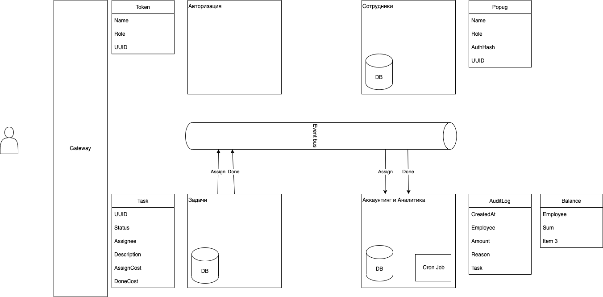

# Асинхронная архитектура 4. Домашняя работа

## Сервисы

### Попуги (они же сотрудники)

Ответсвтенность: хранит всех сотрудников-попугов UberPopig Inc. 
Попуг идентифицируется UUID'ом. 
Хранятся в локальной БД (Postgres)
Поля:
 - UUID (PK)
 - Имя
 - Роль
 - --Логин--
 - --Пароль--
 - Хэш изображения формы ключа ;)

Публичное API
 - HTTP GET /employees - список попугов

### Аутентификация

Ответственность: умеет аутентифицировать попугов по логину-пароль. При совпадении выдавать токен.
Токен содержит:
 - Имя
 - Роль
 - UUID

Публичное API
 - HTTP POST /auth - обмен пары логин/пароль на токен

### Задачи

Ответственность: хранит все имеющиеся в системе задачи в локальной БД (Postgres), отслеживает кому назначена задача, отслеживает статус задач
Поля:
 - UUID (PK)
 - Description
 - Status
 - Assignee
 - AssignCost
 - DoneCost

Публичное API
 - HTTP GET /tasks - список задач (с фильтрами)
 - HTTP POST /tasks - создать задачу
 - HTTP POST /tasks/assign - заассайнить задачи
 - HTTP GET /tasks/UUID - данные одной задачи

При ассайне задачи - отправляет событие в общую шину
При выполнении задачи - отправляет событие в общую шину

### Шина обмена событиями (event bus)

Какая-то шина обмена событиями. С гарантией доставки, с гарантией порядка событий, с гарантией однократной доставки
Любой сервис может писать события в шину, может слушать события из шины

### Аналитика и Аккаунтинг

Ответственность: 
 - хранит аудит событий списания/начисления денег попугам, 
 - хранит текущий баланс каждого попуга, 
 - умеет строить отчеты для менеджмента и администраторов

Хранит в локальной БД (Postgres)
Таблицы:
 - AuditLog
   - CreatedAt
   - Employee
   - Amount
   - Reason 
   - Task
 - Balance
   - Employee
   - Sum   

Слушает из шины события об ассайне задачи и о выполнении задачи, реагирует на них обновлением локальной БД

Публичное API
 - HTTP ручки для отчетов

Долполнительно содержит некую периодическую задачу (cron-job?) которая обрабатывает балансы в конце дня и шлет письма, обнуляет балансы