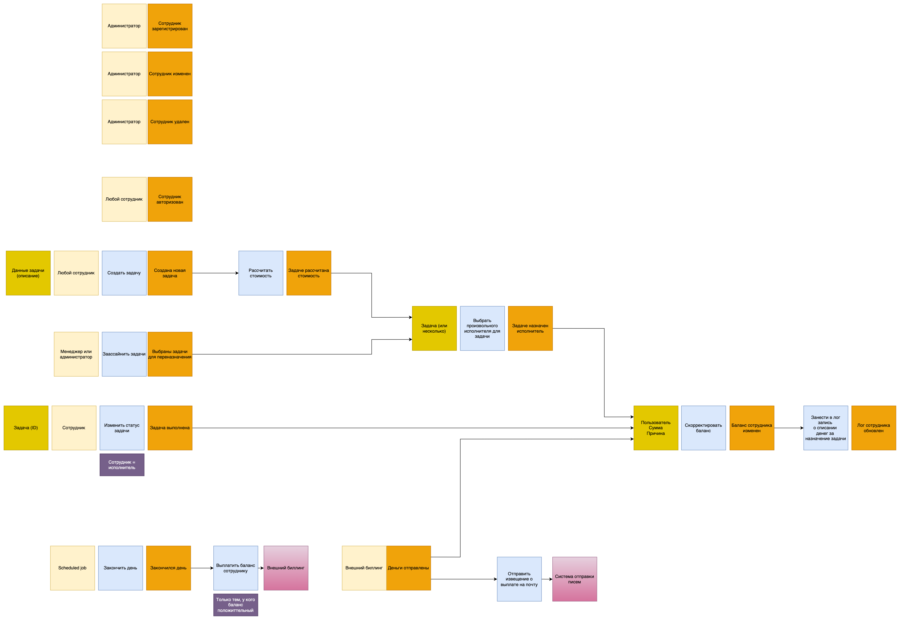
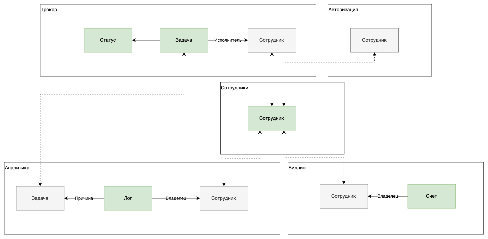

# Домашняя работа №1

## События

### Работа с сотрудниками (пользователями)

- Actor: Администратор
- Command: CreateUser
- Event: UserCreated
- Aggregate: данные о сотруднике (имя, роль, etc...)

- Actor: Администратор
- Command: UpdateUser
- Event: UserUpdated
- Aggregate: ID сотрудника, данные о сотруднике (имя, роль, etc...)

- Actor: Администратор
- Command: DeleteUser
- Event: UserDeleted
- Aggregate: ID сотрудника

### Работа с задачами

- Actor: Любой сотрудник
- Command: CreateTask
- Event: TaskCreated
- Aggregate: данные задачи (описание)

- Actor: TaskCreated
- Command: EstimateTask (расcчитать стоимость ассайна/выполнения)
- Event: TaskEstimated
- Aggregate: ID задачи

- Actor: Менеджер или Администратор
- Command: AssignAllTasks
- Event: AssignTasks
- Aggregate: ID задач для ассайна (все не выполненные)

- Actor: TaskEstimated, AssignTasks
- Command: RandomAssignTask
- Event: TaskAssigned
- Aggregate: ID задачи (или несколько)

- Actor: Сотрудник
- Command: CompleteTask
- Event: TaskCompleted
- Aggregate: ID задачи

### Биллинг

- Actor: Scheduler (Cron job)
- Command: CompleteDay
- Event: DayCompleted

- Actor: DayCompleted
- Command: Payout

- Actor: Внешний биллинг
- Command: CompletePayout
- Event: PayoutCompleted

- Actor: PayoutCompleted
- Command: SendAccountReport

- Actor: TaskAssigned, TaskCompleted, PayoutCompleted
- Command: UpdateAccount
- Event: AccountUpdated
- Aggregate: ID задачи, ID Пользователя, Сумма

### Аналитика

- Actor: AccountUpdated
- Command: UpdateAuditLog
- Event: AuditLogUpdated
- Aggregate: ID задачи, ID Пользователя, Сумма

## Разбиение на сервисы

Выделяем сервисы:
 - AuthService - Авторизация
 - UserService - Сотрудники
 - TrackerService - Трекер
 - AnalyticsService - Аналитика
 - BillingService - Биллинг

### CUD-события

 - User(Created|Updated|Deleted)
 - Producer: UserService
 - Consumer: AuthService, TrackerService, AnalyticsService, BillingService. 

 - TaskCreated
 - Producer: TrackerService
 - Consumer: AnalyticsService
